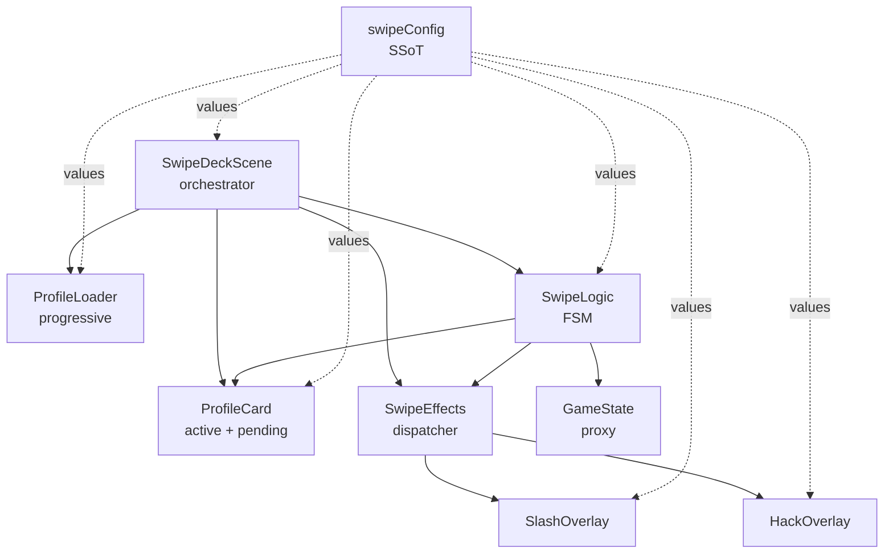

# Swipe Deck Prototype

A Phaser 3 "Hack and Slash" Tinder-style swiper. Built for readability,
modularity, and defensive programming.

- Swipe **right** (or press **D**) to **Slash** - card cuts in half + blood splatter.
- Swipe **left** (or press **A**) to **Hack** - card flies off-screen + binary rain.

## Run it

Open [`index.html`](index.html) in any modern browser. Phaser is bundled in [`lib/phaser.js`](lib/phaser.js).

## Architecture

## File ownership

| File | Owns | Never touches |
| --- | --- | --- |
| [`src/constants/swipeConfig.js`](src/constants/swipeConfig.js) | Every "magic number", color, ratio, easing string | Anything stateful |
| [`src/data/profiles.json`](src/data/profiles.json) | Card deck data (id, name, text, imagePath) | Runtime behavior |
| [`src/systems/GameState.js`](src/systems/GameState.js) | Global hacked-ids set (Proxy-backed, validates input) | Visuals, scenes |
| [`src/systems/ProfileLoader.js`](src/systems/ProfileLoader.js) | JSON + image loading (initial batch + background prefetch) | Card rendering |
| [`src/systems/InputManager.js`](src/systems/InputManager.js) | `SwipeLogic` FSM (IDLE / DRAGGING / ANIMATING), lerp drag, commit flow | Rendering, loading |
| [`src/systems/SwipeEffects.js`](src/systems/SwipeEffects.js) | Thin dispatcher: direction -> correct overlay module | Effect internals |
| [`src/systems/effects/SlashOverlay.js`](src/systems/effects/SlashOverlay.js) | Blood decal + particle burst | Hack visuals, input |
| [`src/systems/effects/HackOverlay.js`](src/systems/effects/HackOverlay.js) | Green tint + falling binary rain | Slash visuals, input |
| [`src/objects/ProfileCard.js`](src/objects/ProfileCard.js) | 70/30 card layout, grab scale, slash cut-in-half animation | Input, state, loading |
| [`src/scenes/SwipeDeckScene.js`](src/scenes/SwipeDeckScene.js) | Deck pointers, stack promotion, scene lifecycle | Tween math, effect math |

## Engineering pillars

| Pillar | Where it lives |
| --- | --- |
| 1. Proxy data validation | [`src/systems/GameState.js`](src/systems/GameState.js) |
| 2. Double-buffered stack (active + pending) | [`src/scenes/SwipeDeckScene.js`](src/scenes/SwipeDeckScene.js) `setupStack` / `promote` |
| 3. Finite State Machine | [`src/systems/InputManager.js`](src/systems/InputManager.js) `States` + `state` field |
| 4. Lerp drag | [`src/systems/InputManager.js`](src/systems/InputManager.js) `handleMove` |
| 5. Async commit flow | [`src/systems/InputManager.js`](src/systems/InputManager.js) `executeCommit` (awaits visuals before promoting) |
| 6. SSoT config | [`src/constants/swipeConfig.js`](src/constants/swipeConfig.js) |
| 7. Procedural slash geometry | [`src/objects/ProfileCard.js`](src/objects/ProfileCard.js) `createSlashHalves` |
| 8. Progressive asset loader | [`src/systems/ProfileLoader.js`](src/systems/ProfileLoader.js) `loadBatch` + `loadInBackground` |
| 9. Responsive percentage layout | [`src/scenes/SwipeDeckScene.js`](src/scenes/SwipeDeckScene.js) `computeBounds` |

## Defensive programming

- **Proxy validation** - `GameState` silently drops non-number, non-array writes.
- **Constructor guards** - `ProfileCard` validates profile + bounds, warns and substitutes safe defaults.
- **Contract assertions** - `SwipeLogic` throws a clear error at construction if the stack adapter is missing `getActive` or `promote`.
- **Texture fallbacks** - Missing profile images render as colored rectangles; slash halves fall back to rectangles too.
- **Lifecycle cleanup** - `SwipeDeckScene.cleanup()` detaches every listener it created on shutdown.
- **Idempotent startup** - `isGameplayStarted` flag guarantees the stack is only built once even if the loader fires a second `complete`.

## How to tune it

All gameplay "feel" values live in [`src/constants/swipeConfig.js`](src/constants/swipeConfig.js):

- `SCENE_CONFIG.swipeThreshold` - how far to drag before a swipe counts.
- `CARD_CONFIG.dragLerp` - how fast the card chases the pointer (0 = no move, 1 = instant snap).
- `CARD_STYLE.panelColor` / `nameFontSize` / etc. - paint the card.
- `EFFECT_CONFIG.bloodCount` / `hackRainMinMs` - tune the blood burst + binary rain.
- `LAYOUT_CONFIG.cardWidthPct` / `cardAspectTall` - responsive card sizing.
- `LOADER_CONFIG.initialBatchSize` - how many images to preload before first render.

Change a value here and the whole system follows. Do not hunt through render files.
