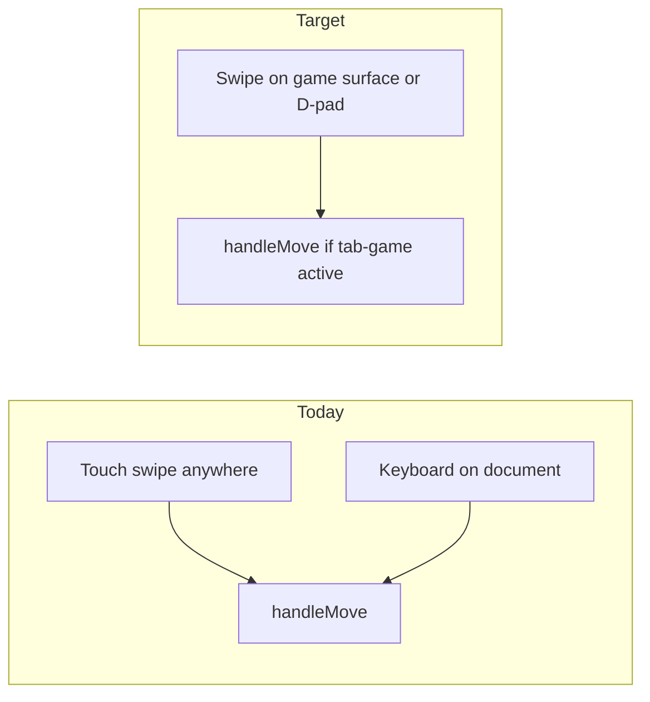
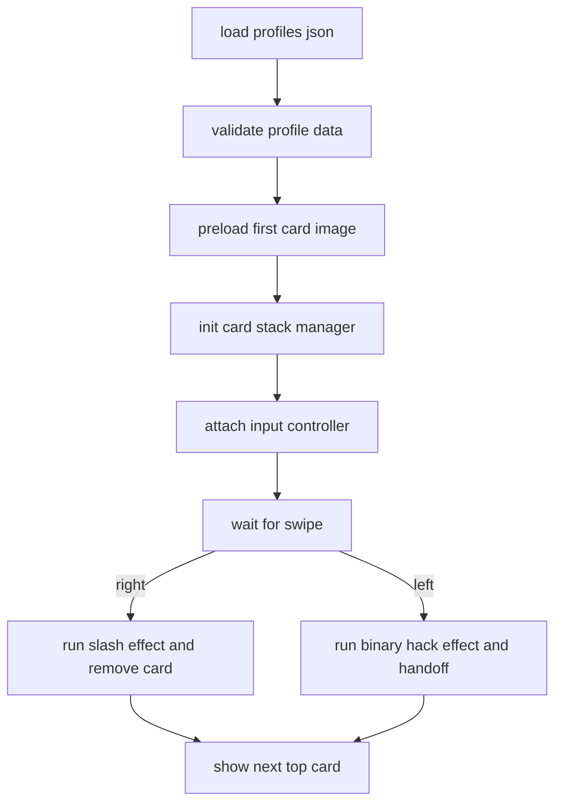
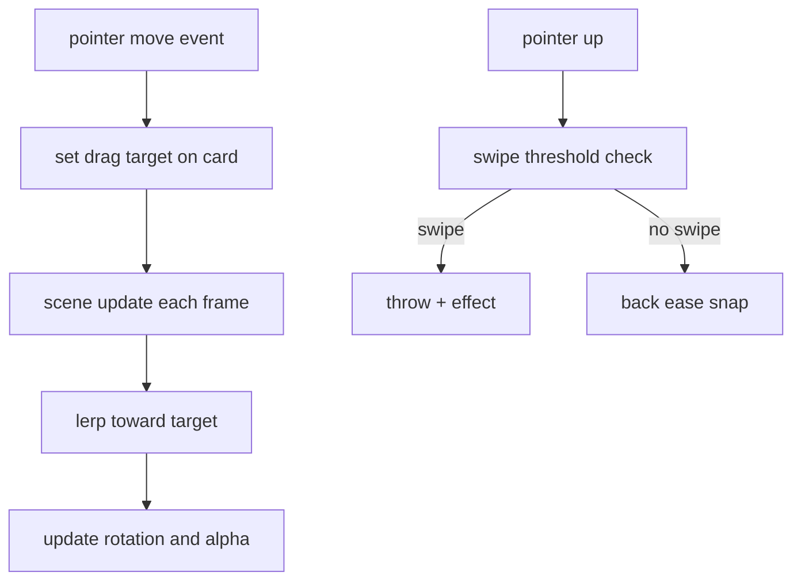
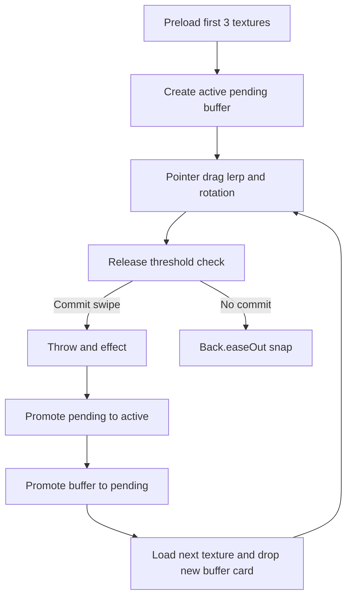
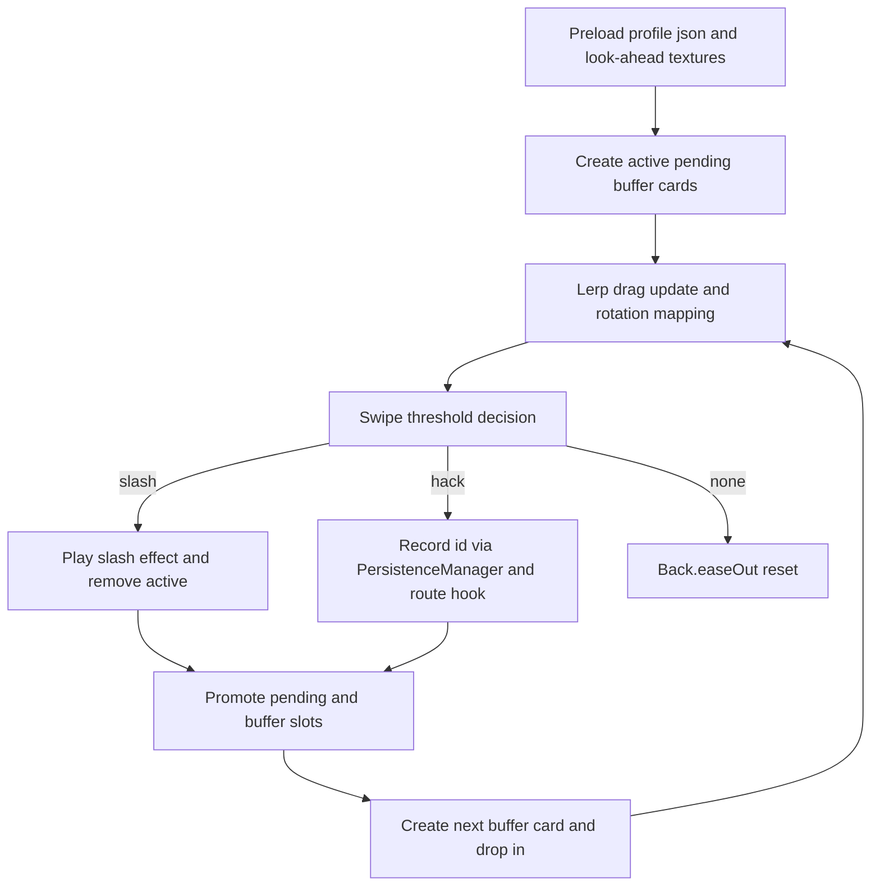
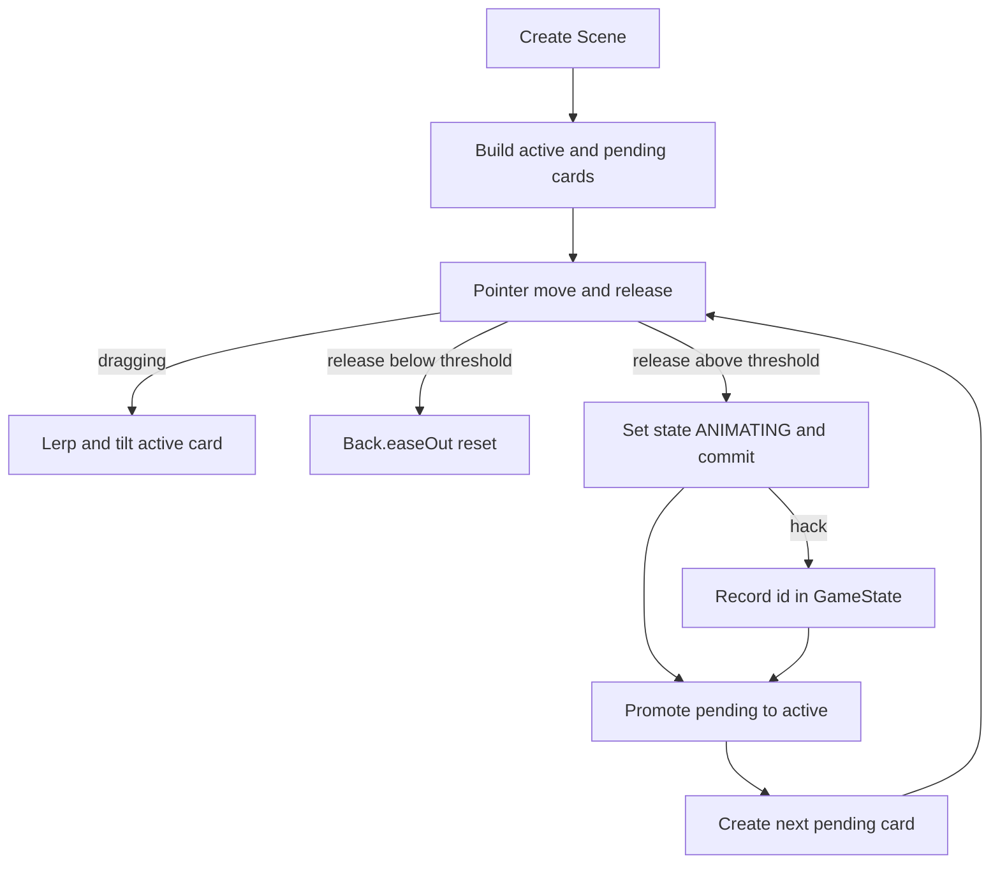
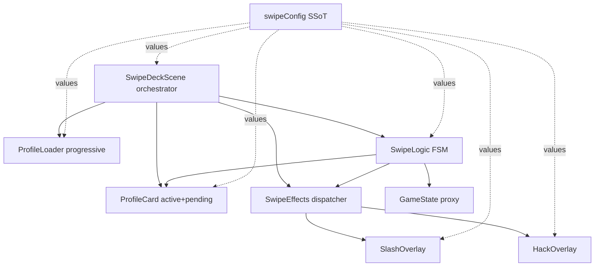

---

# mobile_touch_play_0f3961de

---
name: Mobile touch play
overview: "Treat the project as a mobile-first web app: fix invalid HTML that can break iOS Safari, harden touch input (scoped swipes, optional D-pad), add CSS/viewport behavior for phones and Simulator, and run it via a local HTTP server inside iOS/Android simulators."
todos:
  - id: fix-html
    content: "Repair index.html: valid head, single tab-shop, mobile meta tags"
    status: completed
  - id: scope-touch
    content: "Refactor inputHandler.js: scoped touch + optional keyboard gating + gesture polish"
    status: completed
  - id: guard-move
    content: "Gate handleMove in game.js when #tab-game is not active"
    status: completed
  - id: css-mobile
    content: "style.css: touch-action, safe-area, touch targets; optional D-pad styles"
    status: completed
  - id: dpad-optional
    content: Add optional D-pad UI in index.html + wire to handleMove in game.js
    status: completed
  - id: simulator-docs
    content: Document local static server + Simulator URL workflow (in README or user notes if desired)
    status: completed
isProject: false
---

# Mobile + touch-first plan for 2048 Boss Battle

## Current state (from codebase)

- **Stack**: Static HTML/CSS/ES modules ([`index.html`](index.html), [`game.js`](game.js)) — no build step. Ideal for Simulator testing once served over HTTP.
- **Touch**: [`inputHandler.js`](inputHandler.js) already maps **swipes** on `document` to `onMove` (threshold 30px), alongside **keyboard** (WASD / arrows + debug `K` / `L`).
- **“Mouse”**: There is no grid click-to-move. UI uses `click` listeners in [`game.js`](game.js) and [`renderer.js`](renderer.js). On real phones, **taps on buttons fire `click` after touch** — that is normal and is still “touchscreen” control; you do not need separate mouse handlers for those.
- **Risks**:
  - **[`index.html`](index.html) is structurally invalid**: a full `tab-shop` block and broken `<title>` sit inside `<head>` (lines 5–16), and **`id="tab-shop"` is duplicated** (lines 7 and 150). Duplicate IDs and a corrupted `<head>` can cause unpredictable DOM behavior in **Mobile Safari** (Simulator and devices).
  - **Global swipe listeners**: A swipe anywhere on the page can call `handleMove` whenever `state` is still a live run ([`game.js`](game.js) ~80–84). If the user switches tabs mid-run, swiping on Shop/Menu could still move the board. Moves should be **gated to the game tab** (or to a dedicated touch surface).



## Recommended approach (web app in Simulator — fastest path)

You do **not** need a native app for iPhone/iPad Simulator if you only need the game to run **inside Safari** (or Chrome on Android Emulator). Simulators can open `http://<your-mac-ip>:<port>/` or `http://127.0.0.1:<port>/` to a static server hosting this folder.

### 1. Repair and harden [`index.html`](index.html)

- Move **only** meta, title, fonts, and stylesheet into `<head>`; remove the stray first `tab-shop` fragment from `<head>`.
- Keep **one** `div id="tab-shop"` (delete the duplicate block).
- Add mobile-oriented meta (examples): `theme-color`, `apple-mobile-web-app-capable`, `apple-mobile-web-app-status-bar-style`, and consider `viewport-fit=cover` if you add safe-area padding later.

### 2. Touch input: replace “keyboard-first” with “touch-first” in [`inputHandler.js`](inputHandler.js)

- **Scope** `touchstart` / `touchend` (and any future `touchmove`) to **`#tab-game`** or **`#grid-wrap`** so menus and forms are not accidental swipe targets.
- Add **`touch-action: manipulation`** (CSS) on the game surface to reduce double-tap zoom delay; optionally **`overscroll-behavior: none`** on `body` or `#game-wrap` to reduce scroll chaining while playing.
- **Swipe quality**: Optionally track `touchmove` to require a clearer gesture and ignore small jitter; keep `passive: true` where you cannot `preventDefault`, or use `touch-action` instead of blocking scroll globally.
- **Keyboard**: If the product goal is *only* touch on phones, either:
  - **Remove** keyboard move bindings in production, or
  - **Gate** them behind `matchMedia("(pointer: fine)")` / `!('ontouchstart' in window)` so desktop keeps WASD but phones do not depend on it.
- **Debug `K`/`L`**: Keep off touch-first builds or gate behind a hidden dev flag so normal players do not need keys.

### 3. Optional but high-value: on-screen **D-pad** (true “no swipe required”)

Many players expect visible **up/down/left/right** buttons. Plan:

- Add a small control cluster under [`#grid-wrap`](index.html) (or over it with safe padding), wired to the same `handleMove` callback.
- Style buttons with **min ~44×44pt** touch targets (Apple HIG) in [`style.css`](style.css).
- Ensure D-pad does not overlap critical HUD; hide or shrink on very small heights if needed.

### 4. Mobile layout polish in [`style.css`](style.css)

- **Safe areas**: `padding` on `#tab-bar` / `#game-wrap` using `env(safe-area-inset-*)` for notched iPhones.
- **Touch targets**: Increase padding on `.tab-btn` and small ghost buttons if they feel tight on device.
- **`:hover`**: [`style.css`](style.css) uses hover on tabs; on touch devices hover is cosmetic — acceptable, but active states (`:active`) can improve feedback.

### 5. Gate moves in [`game.js`](game.js) (defense in depth)

- In `handleMove`, return early unless `#tab-game` has class `active` (or equivalent). This prevents stray input if listeners are ever attached broadly.

### 6. Running in **macOS Simulators**

- Start a static server from the project root (any of: `python3 -m http.server`, `npx serve`, etc.) with **network permission** if binding beyond localhost.
- **iOS Simulator (Safari)**: Open Safari → enter the URL. Use **Hardware → Touch Indicators** if you want to see taps.
- **Android Emulator**: Chrome → same URL (may use `10.0.2.2` for host loopback depending on setup).
- **Why HTTP**: `file://` module loading and storage behavior can be flaky across browsers; a simple local server matches real deployment.

### 7. Optional later: “real” app store builds

If you need a home-screen icon, splash, offline cache, or store distribution: add a **Web App Manifest** + **service worker** (PWA), or wrap the same files in **Capacitor** (Xcode/Android Studio projects). That is a larger step than touch fixes; defer unless you need App Store / Play Store.

## Files you will touch most

| File | Purpose |
|------|---------|
| [`index.html`](index.html) | Fix DOM; mobile meta; optional D-pad markup |
| [`inputHandler.js`](inputHandler.js) | Scoped touch; keyboard gating; gesture tweaks |
| [`style.css`](style.css) | `touch-action`, safe areas, D-pad layout, touch targets |
| [`game.js`](game.js) | `handleMove` tab guard |

## Success criteria

- Valid HTML (one `tab-shop`, correct `<head>`), game loads in **iOS Simulator Safari**.
- Board moves reliably via **swipe** (and optionally **D-pad**) with no accidental moves from other tabs.
- No dependency on **keyboard** for core play on touch devices; buttons and overlays remain **tap**-driven.
- Local **HTTP** run documented for Simulator access.


---

# modular_swipe_refactor_914cdf4f

---
name: modular swipe refactor
overview: Refactor the swipe game into small, readable modules with clear responsibilities, keep the binary hack animation, enlarge slash blood effect, and improve load speed through asset optimization plus streamlined preload flow.
todos:
  - id: audit-and-config
    content: introduce top-level config constants and split long functions for readability in core systems
    status: completed
  - id: modular-effects
    content: separate slash and hack effect logic into clear helper modules while preserving current binary hack style
    status: completed
  - id: stack-and-input
    content: tighten card stack lifecycle and input parity with explicit top-card interactivity and clean listener teardown
    status: completed
  - id: asset-optimization
    content: add optimized profile assets and update loading/data flow for faster startup and smoother runtime
    status: completed
  - id: responsive-polish
    content: simplify html/css ownership for centered responsive layout across desktop and mobile
    status: completed
  - id: validate-and-test
    content: add fail-fast profile validation and run lint/manual behavior checks for slash/hack flows
    status: completed
isProject: false
---

# Simplicity-First Swipe Refactor Plan

## Goals
- keep gameplay simple and responsive across desktop and mobile
- preserve current left-swipe hack identity (binary rain 1s/0s)
- make slash blood effect slightly bigger and more readable
- reduce startup and runtime cost with optimized image assets and cleaner preload flow
- enforce readability rules: short functions, guard clauses, config constants, flat logic

## architecture changes (minimal and modular)
- Move scene orchestration out of central logic in [`/Users/mr.x/CMPM170prototypes/CMPM-171-PROTOTYPE-2/game.js`](/Users/mr.x/CMPM170prototypes/CMPM-171-PROTOTYPE-2/game.js) into focused systems.
- Keep card rendering logic in [`/Users/mr.x/CMPM170prototypes/CMPM-171-PROTOTYPE-2/src/objects/SwipeCard.js`](/Users/mr.x/CMPM170prototypes/CMPM-171-PROTOTYPE-2/src/objects/SwipeCard.js), but split heavy animation behavior into small helper methods.
- Keep stack state in [`/Users/mr.x/CMPM170prototypes/CMPM-171-PROTOTYPE-2/src/systems/CardStack.js`](/Users/mr.x/CMPM170prototypes/CMPM-171-PROTOTYPE-2/src/systems/CardStack.js), ensuring only top card is interactive.
- Keep input mapping in [`/Users/mr.x/CMPM170prototypes/CMPM-171-PROTOTYPE-2/src/systems/InputController.js`](/Users/mr.x/CMPM170prototypes/CMPM-171-PROTOTYPE-2/src/systems/InputController.js) with WASD + pointer parity and explicit cleanup.
- Use [`/Users/mr.x/CMPM170prototypes/CMPM-171-PROTOTYPE-2/src/systems/AnimationOverlay.js`](/Users/mr.x/CMPM170prototypes/CMPM-171-PROTOTYPE-2/src/systems/AnimationOverlay.js) as a dispatcher to effect helpers (slash vs hack) for readability.

## readability enforcement implementation
- Add per-file `CONFIG` objects at top for all numeric values (thresholds, distances, durations, scale, blood size).
- Refactor functions over 20 lines into named helpers.
- Replace deep nesting with guard clauses (`if (!activeCard) return` etc).
- Remove unclear variable names; use intent names (`isCardSlashed`, `swipeDirection`, `shouldStartHackTransition`).
- Keep comments short, lowercase, and only where logic benefits from context.

## animation and gameplay behavior
- **Slash (right swipe):** enlarge blood splatter scale and area slightly, then run card fragment/cut sequence, then destroy card and advance stack.
- **Hack (left swipe):** keep current 1s/0s rain style, but modularize and smooth timing; after animation, call a clean handoff method to minigame path (no minigame logic added).
- Keep stack depth visual treatment simple: top card full scale + interactivity, next cards slightly offset/scaled.

## load-time and asset improvements
- Add optimized profile image copies sized for card display and mobile-friendly decode/upload.
- Update profile data mapping in [`/Users/mr.x/CMPM170prototypes/CMPM-171-PROTOTYPE-2/src/data/profiles.json`](/Users/mr.x/CMPM170prototypes/CMPM-171-PROTOTYPE-2/src/data/profiles.json) to use optimized assets.
- Keep progressive load: first profile image preloaded for instant interaction, remaining images loaded immediately after first render.
- Add fail-fast data validation before card creation (required fields, path presence).

## html/css cleanup for responsive framing
- Keep gameplay visuals centered and natural in [`/Users/mr.x/CMPM170prototypes/CMPM-171-PROTOTYPE-2/index.html`](/Users/mr.x/CMPM170prototypes/CMPM-171-PROTOTYPE-2/index.html) and [`/Users/mr.x/CMPM170prototypes/CMPM-171-PROTOTYPE-2/style.css`](/Users/mr.x/CMPM170prototypes/CMPM-171-PROTOTYPE-2/style.css).
- Move presentational layout concerns fully to css and keep js focused on game systems.
- Ensure no unnecessary DOM/CSS complexity is introduced.

## verification
- manual checks: desktop WASD, desktop drag swipe, mobile touch swipe.
- confirm right swipe shows slightly larger blood + cut behavior.
- confirm left swipe shows binary-rain hack effect and clean transition handoff.
- confirm top-card-only interaction and proper cleanup after each action.
- run lint diagnostics on edited files and resolve introduced issues.

## flow diagram



---

# card_drag_smoothness_plan_fb32ae8d

---
name: Card Drag Smoothness Plan
overview: Improve swipe feel by moving drag motion from direct pointer events to frame-based interpolation, adding grab/release feedback, and tuning thresholds/easing for responsiveness without changing core gameplay flow.
todos:
  - id: input-events
    content: add drag start/end target events and dead-zone to input controller
    status: completed
  - id: frame-smoothing
    content: move card motion to scene update loop with lerp smoothing
    status: completed
  - id: card-feedback
    content: add rotation-alpha mapping and grab scale behavior in swipe card
    status: completed
  - id: snap-tuning
    content: switch snapback to back/elastic style easing via config
    status: completed
  - id: verify-feel
    content: manually tune smoothness and threshold values for responsive feel on mouse/touch
    status: completed
isProject: false
---

# Card Drag Smoothness Plan

## what feels unresponsive now
- Drag updates currently happen only in pointer events in [`/Users/mr.x/CMPM170prototypes/CMPM-171-PROTOTYPE-2/src/systems/InputController.js`](/Users/mr.x/CMPM170prototypes/CMPM-171-PROTOTYPE-2/src/systems/InputController.js), not every frame.
- Card movement is 1:1 in [`/Users/mr.x/CMPM170prototypes/CMPM-171-PROTOTYPE-2/src/objects/SwipeCard.js`](/Users/mr.x/CMPM170prototypes/CMPM-171-PROTOTYPE-2/src/objects/SwipeCard.js) via `this.x = this.centerX + dragX`, which feels stiff.
- Snap-back uses a simple tween in [`/Users/mr.x/CMPM170prototypes/CMPM-171-PROTOTYPE-2/src/systems/SwipeFlowController.js`](/Users/mr.x/CMPM170prototypes/CMPM-171-PROTOTYPE-2/src/systems/SwipeFlowController.js), but no grab scale/feedback is applied while dragging.

## implementation strategy
- Keep `InputController` responsible only for input state and target drag values.
- Move smoothing math to scene update loop in [`/Users/mr.x/CMPM170prototypes/CMPM-171-PROTOTYPE-2/src/scenes/SwipeDeckScene.js`](/Users/mr.x/CMPM170prototypes/CMPM-171-PROTOTYPE-2/src/scenes/SwipeDeckScene.js) so it runs every frame.
- Extend `SwipeCard` with methods for:
  - `setDragTarget(dragX, dragY)`
  - `stepTowardsTarget(smoothness)`
  - `updateRotationAndAlpha()`
  - `setGrabState(isGrabbed)`
- Keep swipe decision logic exactly where it is now (threshold in `InputController`) so game rules stay unchanged.

## concrete changes
- [`/Users/mr.x/CMPM170prototypes/CMPM-171-PROTOTYPE-2/src/constants/swipeConfig.js`](/Users/mr.x/CMPM170prototypes/CMPM-171-PROTOTYPE-2/src/constants/swipeConfig.js)
  - Add config values: `dragSmoothness`, `grabScale`, `releaseScale`, `dragDeadZonePx`, `minAlpha`, `alphaRangePx`, `snapEase`.
- [`/Users/mr.x/CMPM170prototypes/CMPM-171-PROTOTYPE-2/src/systems/InputController.js`](/Users/mr.x/CMPM170prototypes/CMPM-171-PROTOTYPE-2/src/systems/InputController.js)
  - Keep pointer handlers, but emit drag targets only.
  - Add `DRAG_START` / `DRAG_END` events for scene to trigger visual state.
  - Add tiny dead-zone before starting drag updates.
- [`/Users/mr.x/CMPM170prototypes/CMPM-171-PROTOTYPE-2/src/scenes/SwipeDeckScene.js`](/Users/mr.x/CMPM170prototypes/CMPM-171-PROTOTYPE-2/src/scenes/SwipeDeckScene.js)
  - Store latest drag target from input.
  - In `update()`, call `activeCard.stepTowardsTarget(...)` every frame.
  - Apply grab/release state transitions.
- [`/Users/mr.x/CMPM170prototypes/CMPM-171-PROTOTYPE-2/src/objects/SwipeCard.js`](/Users/mr.x/CMPM170prototypes/CMPM-171-PROTOTYPE-2/src/objects/SwipeCard.js)
  - Replace direct drag assignment with lerp/chase math.
  - Map horizontal distance to rotation.
  - Map horizontal distance to alpha clamp for better intent feedback.
- [`/Users/mr.x/CMPM170prototypes/CMPM-171-PROTOTYPE-2/src/systems/SwipeFlowController.js`](/Users/mr.x/CMPM170prototypes/CMPM-171-PROTOTYPE-2/src/systems/SwipeFlowController.js)
  - Use `Back.easeOut` for snapback (or configurable equivalent).

## expected result
- card feels smoother and more premium because motion updates every frame
- drag has slight inertia instead of stiff pointer lock
- grab interaction feels responsive due to subtle scale feedback
- release behavior feels intentional with springy return tween

## flow



---

# lookahead-stack-layout-plan_fce19220

---
name: lookahead-stack-layout-plan
overview: Implement a no-pop three-card look-ahead stack with gated texture readiness, plus config-driven phone-frame layout using manual insets and a strict 70/30 card split that touches top and bottom of the frame interior.
todos:
  - id: layout-config
    content: add manual frame inset and 70/30 split config values in swipeConfig
    status: completed
  - id: loader-gating
    content: add three-card preload and ensureTextureReady gating in ProfileLoader
    status: completed
  - id: card-layout
    content: update SwipeCard to accept computed layout and render 70/30 regions
    status: completed
  - id: stack-slots
    content: refactor scene to explicit active/pending/buffer slots and guarded card creation
    status: completed
  - id: promotion-dropin
    content: implement promote+drop lifecycle so new buffer card drops from top
    status: completed
  - id: validation-pass
    content: verify no texture pop, smooth drag, and frame-touch layout across resize
    status: completed
isProject: false
---

# Look-Ahead Stack and Layout Plan

## goals
- remove texture popping completely by guaranteeing `activeCard`, `pendingCard`, and `bufferCard` readiness
- make card layout fit the phone frame interior with manual inset constants
- enforce 70/30 vertical split for image/text inside each card
- keep drag feel smooth (lerp + rotational mapping) and snapback readable (`Back.easeOut`)

## architecture updates
- Use a deterministic 3-slot runtime model in [`/Users/mr.x/CMPM170prototypes/CMPM-171-PROTOTYPE-2/src/scenes/SwipeDeckScene.js`](/Users/mr.x/CMPM170prototypes/CMPM-171-PROTOTYPE-2/src/scenes/SwipeDeckScene.js):
  - `activeCard` (interactive)
  - `pendingCard` (already visible behind active)
  - `bufferCard` (prepared next profile, can be offscreen or hidden)
- Add texture readiness gating in [`/Users/mr.x/CMPM170prototypes/CMPM-171-PROTOTYPE-2/src/systems/ProfileLoader.js`](/Users/mr.x/CMPM170prototypes/CMPM-171-PROTOTYPE-2/src/systems/ProfileLoader.js) so cards are only instantiated after their texture exists.
- Keep swipe decision flow in [`/Users/mr.x/CMPM170prototypes/CMPM-171-PROTOTYPE-2/src/systems/InputController.js`](/Users/mr.x/CMPM170prototypes/CMPM-171-PROTOTYPE-2/src/systems/InputController.js) and throw/snap behavior in [`/Users/mr.x/CMPM170prototypes/CMPM-171-PROTOTYPE-2/src/systems/SwipeFlowController.js`](/Users/mr.x/CMPM170prototypes/CMPM-171-PROTOTYPE-2/src/systems/SwipeFlowController.js).

## config-driven frame and card layout
- Extend [`/Users/mr.x/CMPM170prototypes/CMPM-171-PROTOTYPE-2/src/constants/swipeConfig.js`](/Users/mr.x/CMPM170prototypes/CMPM-171-PROTOTYPE-2/src/constants/swipeConfig.js) with `LAYOUT_CONFIG`:
  - `imageRatio: 0.7`, `textRatio: 0.3`
  - `frameInsets: { top, right, bottom, left }` (manual source of truth)
  - `pendingOffsetY`, `bufferStartY`, `bufferDropTweenMs`
  - `frameFitScale` and optional `cardMaxAspect`
- Scene computes frame inner bounds from camera + manual insets and passes calculated card dimensions into card creation.
- `SwipeCard` stops relying on fixed height/offset and consumes computed dimensions.

## profile card class updates
- In [`/Users/mr.x/CMPM170prototypes/CMPM-171-PROTOTYPE-2/src/objects/SwipeCard.js`](/Users/mr.x/CMPM170prototypes/CMPM-171-PROTOTYPE-2/src/objects/SwipeCard.js):
  - accept `layout` (`cardWidth`, `cardHeight`, `imageHeight`, `textHeight`)
  - render image in top 70% region and text panel/content in bottom 30%
  - keep existing lerp/rotation/alpha behavior but base geometry on layout object

## no-pop preload strategy (three-card buffer)
- In [`/Users/mr.x/CMPM170prototypes/CMPM-171-PROTOTYPE-2/src/systems/ProfileLoader.js`](/Users/mr.x/CMPM170prototypes/CMPM-171-PROTOTYPE-2/src/systems/ProfileLoader.js):
  - preload first 3 profile textures during startup when available
  - expose `ensureTextureReady(profile, onReady)` helper for deferred runtime loads
- In scene:
  - only create cards when `ensureTextureReady` resolves
  - never promote a card whose texture is unresolved

## promotion + drop-in lifecycle
- On slash/hack completion:
  - remove `activeCard`
  - instantly promote `pendingCard` to `activeCard`
  - promote `bufferCard` to `pendingCard`
  - create next `bufferCard` from next profile and tween from `y = bufferStartY` into pending depth/position
- This logic lives centrally in `SwipeDeckScene` as `promoteCardStack()` + `spawnBufferCard()` helpers.

## file change targets
- [`/Users/mr.x/CMPM170prototypes/CMPM-171-PROTOTYPE-2/src/constants/swipeConfig.js`](/Users/mr.x/CMPM170prototypes/CMPM-171-PROTOTYPE-2/src/constants/swipeConfig.js)
- [`/Users/mr.x/CMPM170prototypes/CMPM-171-PROTOTYPE-2/src/systems/ProfileLoader.js`](/Users/mr.x/CMPM170prototypes/CMPM-171-PROTOTYPE-2/src/systems/ProfileLoader.js)
- [`/Users/mr.x/CMPM170prototypes/CMPM-171-PROTOTYPE-2/src/objects/SwipeCard.js`](/Users/mr.x/CMPM170prototypes/CMPM-171-PROTOTYPE-2/src/objects/SwipeCard.js)
- [`/Users/mr.x/CMPM170prototypes/CMPM-171-PROTOTYPE-2/src/scenes/SwipeDeckScene.js`](/Users/mr.x/CMPM170prototypes/CMPM-171-PROTOTYPE-2/src/scenes/SwipeDeckScene.js)
- [`/Users/mr.x/CMPM170prototypes/CMPM-171-PROTOTYPE-2/src/systems/SwipeFlowController.js`](/Users/mr.x/CMPM170prototypes/CMPM-171-PROTOTYPE-2/src/systems/SwipeFlowController.js) (snap tuning consistency)

## flow



---

# persistence-stack-architecture_ed231de4

---
name: persistence-stack-architecture
overview: Add explicit `ProfileCard`, `CardStackManager`, and `PersistenceManager` classes with strong documentation, two-card look-ahead promotion behavior, and scene-global hacked ID tracking that persists across scene shutdowns.
todos:
  - id: persistence-manager
    content: create scene-global PersistenceManager with hackedCardIDs API
    status: completed
  - id: profile-card-class
    content: implement ProfileCard with 70/30 layout, lerp targeting, rotation mapping, and comments
    status: completed
  - id: card-stack-manager
    content: implement CardStackManager with active/pending/buffer slot lifecycle and no-pop guarantees
    status: completed
  - id: scene-integration
    content: wire SwipeDeckScene to managers and add onHackCommit hook for persistence
    status: completed
  - id: loader-and-config
    content: align ProfileLoader and swipeConfig constants with manager-based flow
    status: completed
  - id: docs-and-validation
    content: complete documentation pass and validate lint + behavior assumptions
    status: completed
isProject: false
---

# Persistence and Stack Manager Plan

## target outcome
- keep the swiper smooth and no-pop with active/pending/buffer card slots
- track hacked profile ids in a global in-memory store accessible by any scene
- add heavily documented, modular systems with short readable functions
- preserve current slash/hack visuals while adding clean hack commit hooks

## new architecture
- Add a scene-global persistence module that is independent from scene lifecycle.
- Add a dedicated `CardStackManager` responsible for:
  - slot ownership (`activeCard`, `pendingCard`, `bufferCard`)
  - look-ahead preparation and promotion
  - drop-in creation of next buffer card from top
- Add a dedicated `ProfileCard` class responsible for:
  - 70/30 image/text rendering inside card container
  - lerp target movement and rotation mapping
  - spring reset behavior and split animation trigger surface

## files to create/update
- New: [`/Users/mr.x/CMPM170prototypes/CMPM-171-PROTOTYPE-2/src/systems/PersistenceManager.js`](/Users/mr.x/CMPM170prototypes/CMPM-171-PROTOTYPE-2/src/systems/PersistenceManager.js)
- New: [`/Users/mr.x/CMPM170prototypes/CMPM-171-PROTOTYPE-2/src/systems/CardStackManager.js`](/Users/mr.x/CMPM170prototypes/CMPM-171-PROTOTYPE-2/src/systems/CardStackManager.js)
- New (or replace role): [`/Users/mr.x/CMPM170prototypes/CMPM-171-PROTOTYPE-2/src/objects/ProfileCard.js`](/Users/mr.x/CMPM170prototypes/CMPM-171-PROTOTYPE-2/src/objects/ProfileCard.js)
- Update: [`/Users/mr.x/CMPM170prototypes/CMPM-171-PROTOTYPE-2/src/scenes/SwipeDeckScene.js`](/Users/mr.x/CMPM170prototypes/CMPM-171-PROTOTYPE-2/src/scenes/SwipeDeckScene.js)
- Update: [`/Users/mr.x/CMPM170prototypes/CMPM-171-PROTOTYPE-2/src/constants/swipeConfig.js`](/Users/mr.x/CMPM170prototypes/CMPM-171-PROTOTYPE-2/src/constants/swipeConfig.js)
- Update (minor): [`/Users/mr.x/CMPM170prototypes/CMPM-171-PROTOTYPE-2/src/systems/ProfileLoader.js`](/Users/mr.x/CMPM170prototypes/CMPM-171-PROTOTYPE-2/src/systems/ProfileLoader.js)

## persistence design
- `PersistenceManager` exports a singleton-like store:
  - `hackedCardIDs: number[]`
  - `addHackedCardID(id)` with duplicate guard
  - `getHackedCardIDs()` (copy return)
  - `clearHackedCardIDs()` for debug/reset
- `SwipeDeckScene.finishHack()` calls `onHackCommit(profile)`.
- `onHackCommit(profile)` records `profile.id` and dispatches/keeps current route event hook for future hacked-list scene wiring.

## stack promotion behavior
- `CardStackManager` keeps 3-slot runtime model and never promotes unresolved textures.
- on resolve:
  - remove `activeCard`
  - `pendingCard -> activeCard`
  - `bufferCard -> pendingCard`
  - spawn next `bufferCard` from top (`bufferStartY`) and tween to buffer slot
- all card creation runs through texture-ready gating in loader to avoid default/missing texture flash.

## layout and feel
- use manual frame inset config to compute inner phone bounds
- set card height to inner bounds height so card touches top and bottom
- compute width by max aspect + inner width clamp
- keep 70/30 split in `ProfileCard`
- keep lerp chase (`0.15` style), rotation mapping, and `Back.easeOut` snap reset

## documentation standard
- each public function gets 2-3 line header comments including purpose, inputs, and why it exists
- add inline tutorial comments in:
  - lerp math
  - stack promotion transitions
  - texture readiness gating path
- enforce short function boundaries by extracting helpers where needed

## flow



---

# full-code-commenting-plan_4c4ce571

---
name: full-code-commenting-plan
overview: Add simple, human-style inline comments across major game files so each key line/block is understandable to teammates, with emphasis on what variables mean and why each step exists.
todos:
  - id: comment-profilecard
    content: add detailed inline comments to ProfileCard.js constructor and core methods
    status: completed
  - id: comment-stack-scene
    content: add lifecycle and slot-transition comments to SwipeDeckScene and CardStackManager
    status: completed
  - id: comment-support-systems
    content: annotate loader/input/flow/persistence systems with practical explanations
    status: completed
  - id: comment-effects-config
    content: annotate effect files and config constants to explain tuning values
    status: completed
  - id: comment-validation
    content: run lint/quick scan to ensure comments are clean and non-breaking
    status: completed
isProject: false
---

# Full Project Commenting Plan

## Goal
- Add clear inline comments in plain language across core game files.
- Explain what each important line/block does and what key values mean (example: `// y position for pending card`).
- Keep comments short, readable, and consistent with your preferred style.

## Commenting Scope
- [`/Users/mr.x/CMPM170prototypes/CMPM-171-PROTOTYPE-2/src/objects/ProfileCard.js`](/Users/mr.x/CMPM170prototypes/CMPM-171-PROTOTYPE-2/src/objects/ProfileCard.js)
- [`/Users/mr.x/CMPM170prototypes/CMPM-171-PROTOTYPE-2/src/scenes/SwipeDeckScene.js`](/Users/mr.x/CMPM170prototypes/CMPM-171-PROTOTYPE-2/src/scenes/SwipeDeckScene.js)
- [`/Users/mr.x/CMPM170prototypes/CMPM-171-PROTOTYPE-2/src/systems/CardStackManager.js`](/Users/mr.x/CMPM170prototypes/CMPM-171-PROTOTYPE-2/src/systems/CardStackManager.js)
- [`/Users/mr.x/CMPM170prototypes/CMPM-171-PROTOTYPE-2/src/systems/PersistenceManager.js`](/Users/mr.x/CMPM170prototypes/CMPM-171-PROTOTYPE-2/src/systems/PersistenceManager.js)
- [`/Users/mr.x/CMPM170prototypes/CMPM-171-PROTOTYPE-2/src/systems/ProfileLoader.js`](/Users/mr.x/CMPM170prototypes/CMPM-171-PROTOTYPE-2/src/systems/ProfileLoader.js)
- [`/Users/mr.x/CMPM170prototypes/CMPM-171-PROTOTYPE-2/src/systems/InputController.js`](/Users/mr.x/CMPM170prototypes/CMPM-171-PROTOTYPE-2/src/systems/InputController.js)
- [`/Users/mr.x/CMPM170prototypes/CMPM-171-PROTOTYPE-2/src/systems/SwipeFlowController.js`](/Users/mr.x/CMPM170prototypes/CMPM-171-PROTOTYPE-2/src/systems/SwipeFlowController.js)
- [`/Users/mr.x/CMPM170prototypes/CMPM-171-PROTOTYPE-2/src/systems/AnimationOverlay.js`](/Users/mr.x/CMPM170prototypes/CMPM-171-PROTOTYPE-2/src/systems/AnimationOverlay.js)
- [`/Users/mr.x/CMPM170prototypes/CMPM-171-PROTOTYPE-2/src/systems/effects/HackEffect.js`](/Users/mr.x/CMPM170prototypes/CMPM-171-PROTOTYPE-2/src/systems/effects/HackEffect.js)
- [`/Users/mr.x/CMPM170prototypes/CMPM-171-PROTOTYPE-2/src/systems/effects/SlashEffect.js`](/Users/mr.x/CMPM170prototypes/CMPM-171-PROTOTYPE-2/src/systems/effects/SlashEffect.js)
- [`/Users/mr.x/CMPM170prototypes/CMPM-171-PROTOTYPE-2/src/constants/swipeConfig.js`](/Users/mr.x/CMPM170prototypes/CMPM-171-PROTOTYPE-2/src/constants/swipeConfig.js)

## Comment Style Rules
- Use short lowercase comments near the code they explain.
- Prefer “what this value means” comments over repeating obvious syntax.
- Add line-level comments for position math, layout ratios, tween timing, and stack transitions.
- Keep comments practical (teammate-friendly), not textbook/overly formal.

## Execution Steps
1. Annotate `ProfileCard.js` first (constructor fields, layout math, drag lerp, split animation).
2. Annotate scene/manager flow (`SwipeDeckScene`, `CardStackManager`) with stack lifecycle notes.
3. Annotate input/loader/flow systems with event and readiness explanations.
4. Annotate constants to explain tuning knobs and coordinate meaning.
5. Run lint check to ensure comments did not introduce formatting errors.

## Quality Check
- Confirm each function has at least one meaningful explanation comment.
- Confirm key math lines (x/y offsets, ratios, thresholds, scales, tween durations) have inline meaning.
- Keep file behavior unchanged (comments only).

---

# four-module-rewrite-plan_151c2dbb

---
name: four-module-rewrite-plan
overview: Refactor the swiper into a 4-module architecture (Proxy GameState, ProfileCard, SwipeLogic state machine, slim SwipeDeckScene) with safer cross-scene behavior, no-pop stack promotion, and readable isolated modules.
todos:
  - id: state-and-store
    content: add proxy GameState with safe helper methods for hacked ids
    status: completed
  - id: profile-card-slim
    content: simplify ProfileCard to compact 70/30 layout plus unified animation method
    status: completed
  - id: swipe-logic-machine
    content: implement InputManager SwipeLogic with IDLE/DRAGGING/ANIMATING state flow
    status: completed
  - id: scene-rewrite
    content: rewrite SwipeDeckScene around active/pending promotion and onHackCommit hook
    status: completed
  - id: constants-cleanup
    content: trim and align config to new 4-module architecture
    status: completed
  - id: verify-and-lint
    content: validate no-pop promotion, stable input lock, and run lint diagnostics
    status: completed
isProject: false
---

# Four Module Rewrite Plan

## Goal
- Replace the current multi-system wiring with 4 focused modules.
- Keep state flow safe across scenes using a strict swipe state machine.
- Preserve no-pop look-ahead behavior (active + pending card prepared ahead).
- Keep code easy to edit by isolating responsibilities.

## Module architecture
- `GameState` (global persistence, proxy-backed)
- `ProfileCard` (render/layout + card-local animation)
- `SwipeLogic` (input + swipe state machine + commit flow)
- `SwipeDeckScene` (data load + stack promotion + orchestration)

## File changes
- **New/replace:** [`/Users/mr.x/CMPM170prototypes/CMPM-171-PROTOTYPE-2/src/systems/GameState.js`](/Users/mr.x/CMPM170prototypes/CMPM-171-PROTOTYPE-2/src/systems/GameState.js)
- **Update:** [`/Users/mr.x/CMPM170prototypes/CMPM-171-PROTOTYPE-2/src/objects/ProfileCard.js`](/Users/mr.x/CMPM170prototypes/CMPM-171-PROTOTYPE-2/src/objects/ProfileCard.js)
- **New:** [`/Users/mr.x/CMPM170prototypes/CMPM-171-PROTOTYPE-2/src/systems/InputManager.js`](/Users/mr.x/CMPM170prototypes/CMPM-171-PROTOTYPE-2/src/systems/InputManager.js)
- **Rewrite:** [`/Users/mr.x/CMPM170prototypes/CMPM-171-PROTOTYPE-2/src/scenes/SwipeDeckScene.js`](/Users/mr.x/CMPM170prototypes/CMPM-171-PROTOTYPE-2/src/scenes/SwipeDeckScene.js)
- **Trim/update constants:** [`/Users/mr.x/CMPM170prototypes/CMPM-171-PROTOTYPE-2/src/constants/swipeConfig.js`](/Users/mr.x/CMPM170prototypes/CMPM-171-PROTOTYPE-2/src/constants/swipeConfig.js)

## Implementation details

### 1) Proxy-backed global state (`GameState`)
- Implement `GameState` with `hackedIds: Set` and proxy validation for bulk assignment.
- Add explicit helper methods (`recordHack`, `getHackedIDs`, `clearHacks`) so scene code does not mutate internals directly.
- Keep in-memory only (persists across scene switches, resets on refresh).

### 2) Slim `ProfileCard`
- Keep constructor signature: `(scene, x, y, profileData, bounds)`.
- Keep 70/30 layout creation in one `initLayout()` pass.
- Keep single `animate(targetProps, duration, ease)` Promise helper.
- Keep slash animation entrypoint (`playSlashAnimation`) and expose profile id.

### 3) State machine swipe controller (`SwipeLogic`)
- Implement `States = { IDLE, DRAGGING, ANIMATING }`.
- `handleMove` applies lerp + rotational mapping only in `DRAGGING`.
- `handleRelease`:
  - if threshold not met, spring reset (`Back.easeOut`) and return to `IDLE`
  - if threshold met, run commit path with locked `ANIMATING` state
- `executeCommit(action)` performs movement + hack recording + stack promotion.

### 4) Minimal scene (`SwipeDeckScene`)
- Own only deck data, stack pointers, and scene-level hooks.
- Build `active` and `pending` at startup; keep `pending` ready before removing `active`.
- Promotion sequence:
  - destroy old active
  - promote pending -> active
  - create new pending
  - optionally drop pending from top for continuity
- Keep hook method `onHackCommit(profileId)` for future hacked-list scene bridge.

### 5) no-pop and safety guarantees
- Ensure texture key is available before card creation.
- Keep promotion order deterministic so no default texture frame appears.
- Use `ANIMATING` lock to prevent rapid multi-input conflicts.

## Validation
- Confirm slash/hack/swipe-reset all work with state machine lock.
- Confirm hacked ids persist after scene transitions.
- Confirm pending card always exists before promotion.
- Run lint checks on changed files.

## Flow



---

# security-modularity-hardening_3896799a

---
name: security-modularity-hardening
overview: Align the codebase with Pillars 6-9 (SSoT config, procedural slash, progressive loader, responsive bounds) and tighten defensive programming + strict single-responsibility across every module.
todos:
  - id: config-expand
    content: add CARD_STYLE, EFFECT_STYLE, LOADER_CONFIG blocks to swipeConfig.js
    status: completed
  - id: profile-loader
    content: build ProfileLoader module with loadBatch + loadInBackground progressive strategy
    status: completed
  - id: effects-split
    content: split SwipeEffects into SlashOverlay + HackOverlay files with a tiny dispatcher
    status: completed
  - id: responsive-bounds
    content: replace fixed pixel insets with percentage-based bounds and aspect clamps
    status: completed
  - id: card-guards
    content: add guard clauses + config-driven styling + slash texture fallback in ProfileCard
    status: completed
  - id: logic-guards
    content: assert stack adapter shape in SwipeLogic constructor
    status: completed
  - id: scene-lifecycle
    content: add isGameplayStarted flag + explicit input off() + null-safe applyLayout
    status: completed
  - id: readme-diagram
    content: write README with architecture diagram and file ownership table
    status: completed
  - id: final-lint
    content: lint all changed files and run resize/rapid-swipe manual smoke check
    status: completed
isProject: false
---

# Security + Modularity Hardening Plan

## Goal
Push the current 5-module build to the "teacher-ready" version: every magic number in config, every effect in its own file, a dedicated progressive loader, percentage-based responsive bounds, and guard clauses in every public constructor/method.

## Priority 1 - Pillar alignment (high value)

### A) Progressive loader (Pillar 8)
**New file:** [`src/systems/ProfileLoader.js`](src/systems/ProfileLoader.js)
- Owns JSON + image loading. Scene calls it and listens.
- API:
  - `preloadJson(scene)` - queues profiles.json in preload phase
  - `getValidProfiles(scene)` - reads + filters cache
  - `loadBatch(scene, profiles, startIndex, count)` - queues `count` images starting at `startIndex`, returns Promise that resolves on load complete
  - `loadInBackground(scene, profiles, startIndex)` - uses `scene.time.delayedCall` to lazy-load remaining images after first batch renders
  - `isTextureReady(scene, profile)` - boolean check
- **Behavior:** load first 3 images on startup (active + pending + 1 spare), then schedule remaining images in idle time so no stutter when the user swipes.
- Scene code stays thin: `await loader.loadBatch(scene, profiles, 0, 3)` then `loader.loadInBackground(scene, profiles, 3)`.

### B) Responsive percentage bounds (Pillar 9)
**Update:** [`src/scenes/SwipeDeckScene.js`](src/scenes/SwipeDeckScene.js) `computeBounds()`
- Replace fixed pixel `frameInsets` with percentages driven by config:
```
width = cameraWidth * LAYOUT_CONFIG.cardWidthPct
height = Math.min(cameraHeight * LAYOUT_CONFIG.cardHeightPct, width * LAYOUT_CONFIG.cardAspectTall)
```
- Clamp with `LAYOUT_CONFIG.cardMinWidth` / `cardMaxWidth` so very narrow or very wide screens still look right.
- Works identically on phone portrait, desktop landscape, and vertical monitor.

### C) SSoT config expansion (Pillar 6)
**Update:** [`src/constants/swipeConfig.js`](src/constants/swipeConfig.js)
- Add `CARD_STYLE` block for text/panel values currently hardcoded in ProfileCard: `panelColor`, `nameFontSize`, `nameColor`, `descFontSize`, `descColor`, `wrapRatio`, `nameYPct`, `descYPct`, `panelYPct`, `imageYPct`, `grabTweenMs`, `grabEase`.
- Add `EFFECT_STYLE` block for colors/dimensions currently hardcoded in SwipeEffects: `bloodDecalColor`, `bloodDecalAlpha`, `bloodBlobCount`, `bloodParticleLifespan`, `hackTintColor`, `hackTintAlphaStart`, `hackTintAlphaPeak`, `hackTextColor`, `hackTextStrokeColor`, `hackTextShadowColor`, `hackTextFontSize`, `hackSpawnYOffset`, `hackColumnAlpha`.
- Add `LOADER_CONFIG`: `initialBatchSize: 3`, `backgroundDelayMs: 200`.

## Priority 2 - Strict single-responsibility split

### D) Effects per-file split
**New files:**
- [`src/systems/effects/SlashOverlay.js`](src/systems/effects/SlashOverlay.js) - owns blood decal + particle burst. Exposes `play(scene, x, y) -> Promise`.
- [`src/systems/effects/HackOverlay.js`](src/systems/effects/HackOverlay.js) - owns green tint + binary rain. Exposes `play(scene) -> Promise`.

**Shrink:** [`src/systems/SwipeEffects.js`](src/systems/SwipeEffects.js) becomes a ~20-line dispatcher:
```javascript
play(direction, x, y) {
  if (direction === SWIPE_DIRECTIONS.SLASH) return SlashOverlay.play(this.scene, x, y);
  if (direction === SWIPE_DIRECTIONS.HACK) return HackOverlay.play(this.scene);
  return Promise.resolve();
}
```
- Now each effect can be swapped independently (add Freeze, Explode, etc.) without touching the dispatcher.

## Priority 3 - Defensive programming pass

### E) Guard clauses in every public entry
- [`src/objects/ProfileCard.js`](src/objects/ProfileCard.js) constructor: guard `profile`, `profile.id`, `bounds.width`, `bounds.height`. Use `console.warn` + safe defaults so one bad profile never kills the deck.
- [`src/systems/InputManager.js`](src/systems/InputManager.js) `SwipeLogic` constructor: assert `stack.getActive` and `stack.promote` exist; throw clear error if missing (developer-facing safety, not runtime).
- [`src/scenes/SwipeDeckScene.js`](src/scenes/SwipeDeckScene.js):
  - `isGameplayStarted` flag in `startGameplay` so a second `load.complete` (from lazy batch) never rebuilds the stack.
  - Explicit off() for pointerdown/pointermove/pointerup/keydown in `cleanup()` so scene restart never leaks.
  - Null-check `applyLayout(bounds)` input; skip if width/height <= 0 (tiny window during resize).

### F) Slash fallback safety (Pillar 7)
- [`src/objects/ProfileCard.js`](src/objects/ProfileCard.js) `createSlashHalves()`: if `scene.textures.exists(textureKey)` is false, fall back to colored rectangles the same color as the panel so the slash never throws.

## Priority 4 - Documentation

### G) README architecture diagram
**Update:** [`README.md`](README.md)
- 1-page arch diagram + file ownership table so a teacher/reviewer can navigate without reading code.

## Updated architecture



## File changes summary
- **New:** `src/systems/ProfileLoader.js`
- **New:** `src/systems/effects/SlashOverlay.js`
- **New:** `src/systems/effects/HackOverlay.js`
- **Shrink/rewrite:** `src/systems/SwipeEffects.js` (dispatcher only)
- **Update:** `src/constants/swipeConfig.js` (CARD_STYLE, EFFECT_STYLE, LOADER_CONFIG blocks)
- **Update:** `src/objects/ProfileCard.js` (guards + config-driven styling + slash fallback)
- **Update:** `src/systems/InputManager.js` (stack adapter guards)
- **Update:** `src/scenes/SwipeDeckScene.js` (percentage bounds + loader wiring + lifecycle hardening)
- **Update:** `README.md` (architecture diagram + file table)

## Validation
- Lint pass on every changed file.
- Manual check: resize window during gameplay - no stretched visuals, no crash.
- Manual check: swipe rapidly - state machine prevents chained commits.
- Manual check: invalid profile entry in JSON - warns but keeps running.
- Manual check: drag slower than 150px threshold - snaps back cleanly.


---

# explicit-guards-refactor_ab454d7f

---
name: explicit-guards-refactor
overview: Replace every instance of ??, ?., and ternaries in src/ with verbose if/else guards and explanatory comments, plus two Sourcery-AI bug fixes (monotonic fallback IDs + deck-length stability).
todos:
  - id: profileloader
    content: Rewrite ProfileLoader.getValidProfiles with two explicit guards replacing ?. and ??
    status: completed
  - id: inputmanager
    content: Expand InputManager constructor (2 sites), handleKey (2 sites), executeCommit (3 sites) to if/else blocks
    status: completed
  - id: swipedeckscene
    content: Expand SwipeDeckScene setupInput and cleanup keyboard accessors to explicit if checks
    status: completed
  - id: profilecard
    content: Expand ProfileCard.validateBounds width/height and setGrabState targetScale ternaries
    status: completed
  - id: hackoverlay
    content: Expand HackOverlay.makeBinaryText random-digit ternary to if/else
    status: completed
  - id: fallback-ids
    content: Replace Date.now() fallback ids in ProfileCard.validateProfile with a monotonic module-level counter (Sourcery bug fix)
    status: completed
  - id: createcard-stability
    content: Remove isTextureReady gate from SwipeDeckScene.createCard so ProfileCard fallback renders and deck length stays stable (Sourcery bug fix)
    status: completed
  - id: verify
    content: Grep for any remaining ??/?./ternaries in src and run ReadLints on all touched files
    status: completed
isProject: false
---

# Explicit Guards Refactor

## Goal
Make every safety check and conditional assignment readable by a reader who does not know `??`, `?.`, or ternaries. Every expanded guard gets a short `//` comment explaining what it is checking for.

## Scope
- Strip: `??`, `?.`, and `a ? b : c` ternaries.
- Keep: destructuring, spread, array methods (`.map`/`.filter`/`.forEach`), default params, arrow functions, `async`/`await`.
- Ignore: `lib/phaser.js` (vendor), `profiles.json`, `style.css`, markdown.

## Files affected (5)
- [src/systems/ProfileLoader.js](src/systems/ProfileLoader.js)
- [src/systems/InputManager.js](src/systems/InputManager.js)
- [src/scenes/SwipeDeckScene.js](src/scenes/SwipeDeckScene.js)
- [src/objects/ProfileCard.js](src/objects/ProfileCard.js)
- [src/systems/effects/HackOverlay.js](src/systems/effects/HackOverlay.js)

## Per-location transforms (15 sites)

### ProfileLoader.js (1 site: `??` + `?.`)
```js
// BEFORE
const data = scene.cache.json.get(SCENE_CONFIG.profileJsonKey);
const raw = data?.profiles ?? [];
return raw.filter((profile) => this.isProfileRenderable(profile));

// AFTER
const data = scene.cache.json.get(SCENE_CONFIG.profileJsonKey);
// bail early if the cache entry is missing
if (!data) return [];
// bail early if the profiles field is not an array
if (!Array.isArray(data.profiles)) return [];
return data.profiles.filter((profile) => this.isProfileRenderable(profile));
```

### InputManager.js (5 sites: 2× `??`, 2× `?.`, 3× ternary)

- **Lines 26-27:** `options.threshold ?? …` and `options.effects ?? null` → explicit `if/else` blocks with comments "use caller-provided threshold if given" / "default to no effects when none provided".
- **Line 106:** `event.key?.toLowerCase()` → `if (!event.key) return;` guard, then `const key = event.key.toLowerCase();`.
- **Line 109:** `const direction = key === "d" ? SLASH : HACK;` → `let direction; if (key === "d") direction = SLASH; else direction = HACK;`.
- **Line 141 / 157:** `this.effects ? this.effects.play(...) : Promise.resolve()` inside `Promise.all([...])` → extract to a named local:
  ```js
  // play overlay only if effects subsystem is wired, otherwise use a no-op promise
  let overlayPromise;
  if (this.effects) overlayPromise = this.effects.play(direction, card.x, card.y);
  else overlayPromise = Promise.resolve();
  ```
- **Line 144:** `this.stack.onHackCommit?.(card.id)` → `if (typeof this.stack.onHackCommit === "function") this.stack.onHackCommit(card.id);`

### SwipeDeckScene.js (2 sites: `?.`)
- **Line 176 setupInput:** `this.input.keyboard?.on(...)` → `if (this.input.keyboard) this.input.keyboard.on(...)`.
- **Line 248 cleanup:** `if (this.keyDownHandler) this.input.keyboard?.off(...)` → explicit joined check `if (this.keyDownHandler && this.input.keyboard) { ... }`.

### ProfileCard.js (3 sites: ternary)
- **Lines 51-52 validateBounds:** width and height assignments. Each ternary becomes a 3-line `if/else` with a `//` comment stating "fall back to config minimum when bounds are unusable".
- **Line 160 setGrabState:** `const targetScale = isGrabbed ? CARD_CONFIG.grabScale : CARD_CONFIG.releaseScale;` → explicit `let targetScale; if (isGrabbed) ... else ...`.

### HackOverlay.js (1 site: ternary)
- **Line 66 makeBinaryText:** `digits.push(Math.random() > 0.5 ? "1" : "0")` → explicit `if (Math.random() > 0.5) digits.push("1"); else digits.push("0");` with comment "random bit: 1 or 0".

## Verification
- `rg "\?\?|\?\." src --glob '*.js'` returns zero matches (only comments may contain `?`).
- `rg "\s\?\s" src --glob '*.js'` returns zero non-comment matches.
- ReadLints on all 5 files returns no errors.
- No behavior change: every rewrite produces identical runtime values.

## Non-goals
- Not touching destructuring (`const { width, height } = bounds`).
- Not touching spread (`...targetProps`).
- Not touching array methods (`.filter`, `.forEach`, `.map`).
- Not touching `lib/phaser.js`.